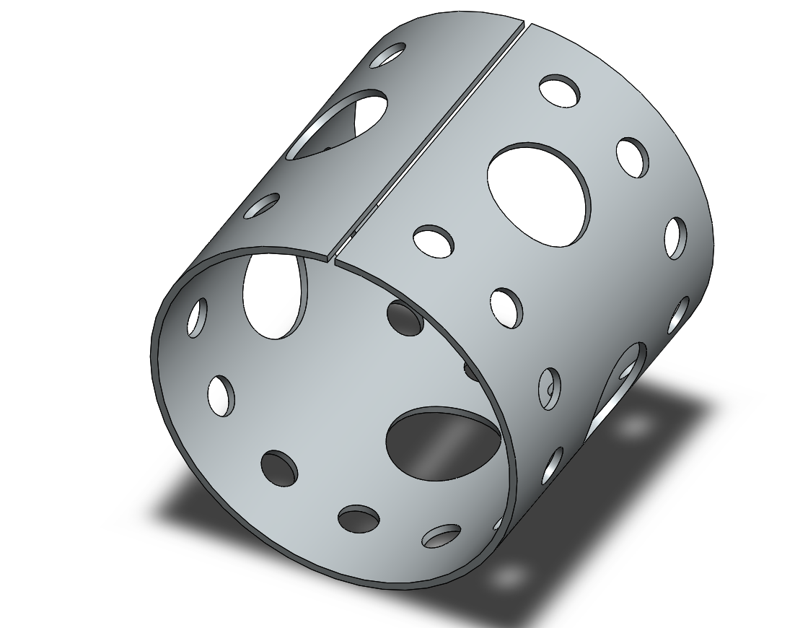

# Part-drawing-01-SW

# Perforated Cylinder Sheet

## Overview

This is a parametric **sheet-metal perforated cylinder** designed in SolidWorks. 
 
It features an array of circular holes of varying diameters, evenly distributed across the surface, suitable for applications like:

- Light enclosures

- Ventilation components

- Filters or strainers

- Decorative elements

---

## Specifications
- **Material:** 5mm Mild Steel (configurable)

- **Diameter:** 240 mm (configurable)

- **Length:** 250 mm (configurable)

- **Hole Pattern:** Circular perforations — multiple diameters arranged in a regular grid

- **Units:** mm (millimetres)

## License
MIT License — feel free to use and modify for personal or commercial projects.

## Author

Nishchay Sharma

>B.Tech (Mechanical Engineering)| Gold Medalist — 2024

>Design Engineer

## File Include
- 'project1_nishchay.  SLDPRT' -
solidworks part file

## License
This project is licensed under the MIT license.

### Isometric View-

**Designed by N1 Conception** 
 
Built with ❤️ in SolidWorks

Thanks for Viewing!