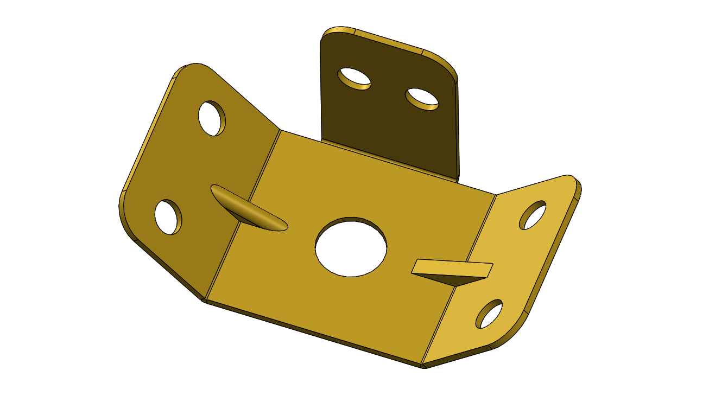

# Part-drawing-02-SW

# Sheet Metal Mounting Bracket 

This repository contains the CAD design of a **sheet metal mounting bracket** created in SolidWorks. 
 
The bracket is designed for structural support and component mounting in assemblies.  

## 📐 Features

- Material: Sheet metal (custom thickness configurable)
  
- Bends: 3-side bent geometry with flanges  

- Cutouts:  

  - Central circular cutout for shaft/pin clearance  

  - Mounting holes for bolts/screws  

  - Locking slots for alignment  

## 🛠️ Applications

- Used as a **support bracket** in mechanical assemblies
  
- Provides **rigid mounting** and **alignment**  

- Can be manufactured via **laser cutting + sheet bending**

## 📂 Files Included

- SolidWorks Part file (`.SLDPRT`)  

## License
MIT License — feel free to use and modify for personal or commercial projects.

## Author

**Nishchay Sharma** 

>B.Tech (Mechanical Engineering)| Gold Medalist — 2024

>Design Engineer
 
>✨ Creator & Owner of [N1 Conception]✨  

## File Include
- 'project2_nishchay.  SLDPRT' -
solidworks part file

## License
This project is licensed under the MIT license.

### Isometric View-

**Designed by N1 Conception** 
 
Built with ❤️ in SolidWorks

Thanks for Viewing!