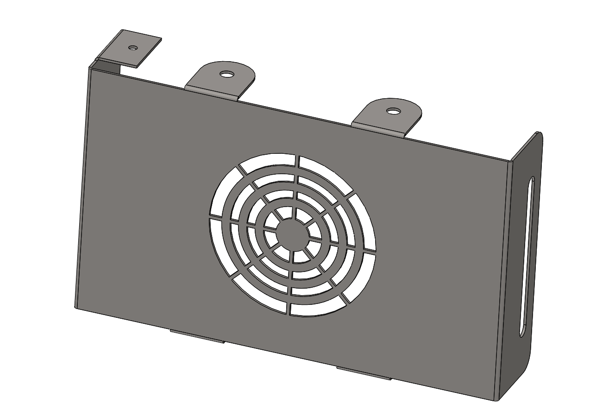
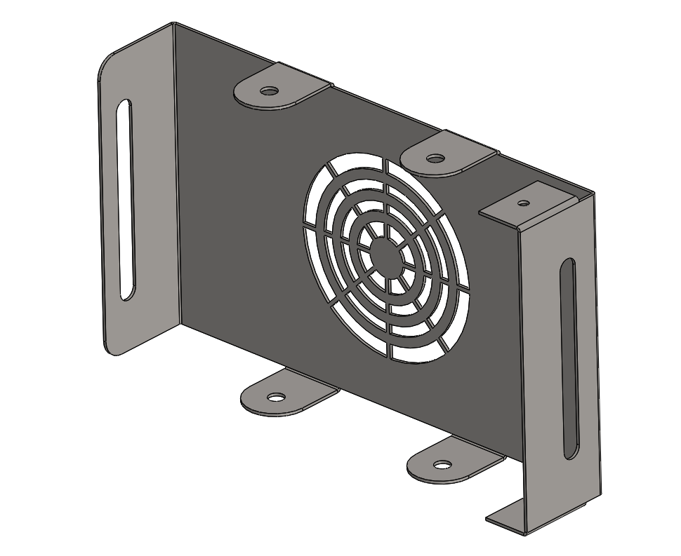

# Part-drawing-03-SW

# AirFlow Guard | Sheet Metal Design  

This project features the **AirFlow Guard**, a **sheet metal enclosure** designed in SolidWorks.  

It integrates both **functionality and protection**, serving as a housing with a built-in **fan vent cutout** for airflow management.  

✨ **Highlights**  

- Designed using SolidWorks Sheet Metal tools  

- Includes precise cutouts for airflow & mounting 
 
- Simple, functional, and optimized for fabrication  

🛠️ **Tools & Features Used**  

- Base Flange 

- Cut-Extrude (Fan Vent Pattern)  

- Edge Flanges & Bends  

- Mounting Holes  
  

## License
MIT License — feel free to use and modify for personal or commercial projects.

## Author

**Nishchay Sharma** 

>B.Tech (Mechanical Engineering)| Gold Medalist — 2024

>Design Engineer
 
>✨ Creator & Owner of [N1 Conception]✨  

## File Include
- 'project3_nishchay.  SLDPRT' -
solidworks part file

## License
This project is licensed under the MIT license.

### Isometric View I-

### Isometric View II-

**Designed by N1 Conception** 
 
Built with ❤️ in SolidWorks

Thanks for Viewing!