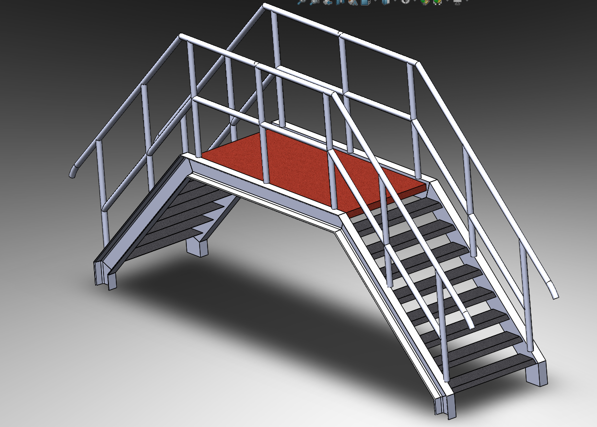

# Part-drawing-04-SW

# 🏗️ Crossover Stairs – SolidWorks Design Sheetmetal X Weldments

This project showcases a **Crossover Stairs** model created in **SolidWorks** using a combination of **Weldments** and **Sheet Metal** features.  
The design is intended for industrial walkways and safe access over obstacles such as pipelines, conveyors, or restricted zones.

---

## 🔹 Features

- **Weldments**

  - Structural members used for stair stringers, handrails, and support frames.

  - Custom profiles for accurate beam and pipe representations.

  - Weld bead representation for realistic fabrication visualization.

- **Sheet Metal**

  - Stair treads and landing platforms modeled with sheet metal tools.

  - Bend allowances and reliefs considered for real-world manufacturing.

  - Flat pattern views available for fabrication drawings.

## ⚙️ Applications

- Industrial walkways & maintenance access

- Crossing conveyors, pipelines, or equipment zones

- Modular staircase design for factories or plants

  

## License
MIT License — feel free to use and modify for personal or commercial projects.

## Author

**Nishchay Sharma** 

>B.Tech (Mechanical Engineering)| Gold Medalist — 2024

>Design Engineer
 
>✨ Creator & Owner of [N1 Conception]✨  

## File Include
- 'project4_nishchay.  SLDPRT' -
solidworks part file

## License
This project is licensed under the MIT license.

### Isometric View -

**Designed by N1 Conception** 
 
Built with ❤️ in SolidWorks

Thanks for Viewing!