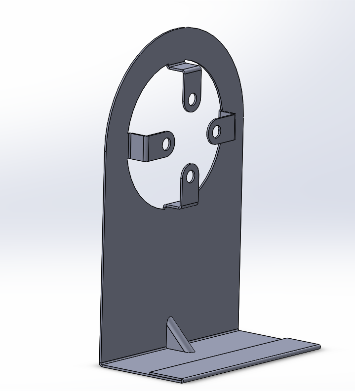

# Part-drawing-05-SW

---

## Modeling Collar Bracket
- Model using **Sheet Metal** features.  

- Use **Global Variables** for key dims for quick edits. 
 
- Add small **bend reliefs** at flange intersections and maintain a minimum edge distance ≥ material thickness for holes.
  
---

## License
MIT License — feel free to reuse and modify. See `LICENSE` file.

---

## Author
**Nishchay Sharma**  
Owner, **N1 Conception**

---

**YouTube preview (optional use in README):**

## License
MIT License — feel free to use and modify for personal or commercial projects.

## Author

**Nishchay Sharma** 

>B.Tech (Mechanical Engineering)| Gold Medalist — 2024

>Design Engineer
 
>✨ Creator & Owner of [N1 Conception]✨  

## File Include
- 'project5_nishchay.  SLDPRT' -
solidworks part file

## License
This project is licensed under the MIT license.

### Isometric View -

**Designed by N1 Conception** 
 
Built with ❤️ in SolidWorks

Thanks for Viewing!